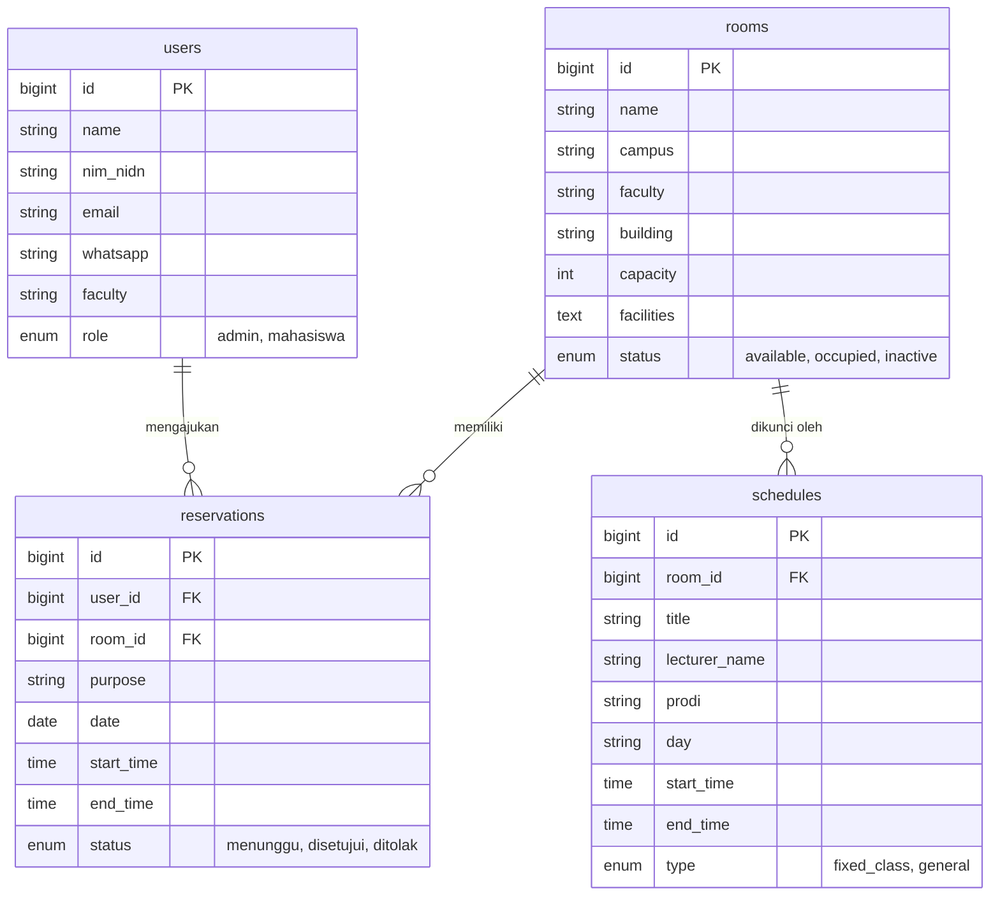

# Smart Class Booking App 🎓

Smart Class Booking adalah aplikasi berbasis web yang dirancang khusus untuk memfasilitasi mahasiswa dan civitas akademika (khususnya di lingkungan Universitas Lambung Mangkurat - ULM) dalam mencari, melihat jadwal ketersediaan, dan melakukan peminjaman ruangan (Kelas, Laboratorium, Aula, Theater) secara modern dan efisien.

Aplikasi ini dilengkapi algoritma cerdas yang mencegah terjadinya bentrok jadwal (*double-booking*) antara kegiatan mahasiswa dengan jadwal perkuliahan rutin kampus, serta dilengkapi dengan sistem notifikasi email otomatis.

---

## 🔑 Fitur Aplikasi & Pembagian Role

Sistem memiliki dua peran (*Role*) utama dengan hak akses yang berbeda:

### 1. Mahasiswa (User)
* **Katalog Ruangan Dinamis:** Mencari dan memfilter ruangan berdasarkan Kampus (Banjarmasin/Banjarbaru), Fakultas, Jenis Ruangan, dan Ketersediaan saat ini.
* **Cek Agenda Harian:** Melihat jadwal pemakaian suatu ruangan pada tanggal tertentu secara *real-time* untuk mencari slot waktu yang kosong.
* **Pengajuan Booking:** Melakukan *booking* ruangan pada rentang waktu yang tersedia. Sistem otomatis akan memblokir pengajuan jika jadwalnya bertabrakan.
* **Riwayat Peminjaman (History):** Melacak status pengajuan apakah sedang Menunggu, Disetujui, atau Ditolak.
* **Notifikasi Email:** Menerima email notifikasi secara langsung ke *inbox* (Gmail) ketika status permohonan berubah.

### 2. Administrator (Admin BAAK / Fakultas)
* **Dashboard Persetujuan:** Mengelola antrean permohonan peminjaman ruangan (Approve/Reject) yang akan otomatis memicu pengiriman email ke mahasiswa terkait.
* **Manajemen Ruangan:** Menambah, mengubah, atau menghapus data fisik ruangan beserta kapasitas dan fasilitasnya.
* **Manajemen Jadwal Akademik (Schedules):** Memasukkan Jadwal Kuliah Rutin (*Fixed Class*) untuk "mengunci" ruangan secara otomatis setiap minggunya agar tidak bisa dibooking oleh mahasiswa.
* **Log Reservasi:** Melihat keseluruhan riwayat peminjaman (*history log*) dari seluruh pengguna.

---

## 🛠 Teknologi yang Digunakan

* **Backend:** Laravel 11 (PHP 8.2+)
* **Frontend:** Laravel Blade Templating
* **Styling:** Tailwind CSS (Utility-first CSS Framework)
* **Interaktivitas:** Vanilla JavaScript (DOM Manipulation)
* **Build Tool:** Vite (Asset Bundling)
* **Database:** MySQL
* **Sistem Email:** SMTP Gmail (Laravel Mailables)

---

## 📂 Arsitektur Aplikasi & Struktur Folder

Aplikasi ini menggunakan pola arsitektur **MVC (Model-View-Controller)** standar Laravel, dengan tambahan lapisan **ViewModel** untuk memisahkan *presentation logic* (logika perhitungan warna, jenis gambar, badge status) dari Controller.

```text
Simari/
├── app/
│   ├── Http/Controllers/     # Menangani alur request (Routing Logic)
│   ├── Mail/                 # Menangani konfigurasi format Email Notifikasi
│   ├── Models/               # Representasi tabel database (Eloquent ORM)
│   └── ViewModels/           # (Custom) Memanipulasi data mentah untuk siap disajikan ke View
├── database/
│   ├── migrations/           # Skema / struktur tabel database
│   └── seeders/              # Data dummy / default bawaan sistem
├── public/                   # Folder terekspos untuk aset statis (gambar, build css/js)
├── resources/
│   ├── css/ & js/            # Source file Tailwind dan Javascript murni
│   └── views/                # File tampilan HTML (.blade.php)
└── routes/                   # Definisi URL routing web (web.php)
```

---

## 📊 Entity Relationship Diagram (ERD)

Berikut adalah relasi antar tabel pada sistem *database*:



---

## 🚀 Cara Menjalankan Program (Localhost)

Pastikan Anda telah menginstal **PHP 8.2+**, **Composer**, **Node.js**, dan web server lokal seperti **Laragon/XAMPP**.

1. **Clone repositori** ini ke komputer Anda.
   ```bash
   git clone https://github.com/Mullet11/Project-Web2-Team8.git
   cd Project-Web2-Team8
   ```

2. **Instal dependensi Backend (PHP)**
   ```bash
   composer install
   ```

3. **Instal dependensi Frontend (Node.js)**
   ```bash
   npm install
   ```

4. **Konfigurasi Environment**
   Salin file konfigurasi bawaan dan ubah kredensial database serta email SMTP Gmail Anda.
   ```bash
   cp .env.example .env
   ```
   Generate *application key*:
   ```bash
   php artisan key:generate
   ```

5. **Migrasi & Seeding Database**
   Perintah ini akan membuat struktur tabel beserta data akun Admin (*admin123/password*) dan contoh ruangan.
   ```bash
   php artisan migrate:fresh --seed
   ```

6. **Build Asset Tailwind & Vite**
   ```bash
   npm run build
   ```

7. **Jalankan Server Lokal**
   ```bash
   php artisan serve
   ```
   *Buka http://localhost:8000 di browser Anda.*

---

## 📡 Dokumentasi Endpoint (Routing Web)

Karena aplikasi ini mengusung pendekatan *Server-Side Rendering (Monolith)*, berikut adalah pemetaan rute utama yang digunakan:

**Public & Auth:**
* `GET /` - Halaman *Landing* & Akses Form Login / Sign Up
* `POST /login` - Autentikasi Pengguna
* `POST /register` - Pendaftaran akun baru Mahasiswa
* `POST /logout` - Akhiri sesi login

**Role Mahasiswa:**
* `GET /dashboard` - Tampilan Utama katalog *filter* ruangan
* `GET /rooms/{id}` - Melihat rincian detail spesifik ruangan
* `GET /rooms/{id}/agenda` - Melihat jadwal / agenda ruangan di hari tertentu
* `GET /rooms/{id}/book` - Form permohonan *booking* ruangan
* `POST /book` - Endpoint penyimpanan data pengajuan peminjaman
* `GET /history` - Melihat *list* riwayat permohonan *booking* sendiri
* `GET /profile` - Menampilkan profil pengguna

**Role Admin:**
* `GET /admin/dashboard` - Panel validasi status (Antrean Persetujuan)
* `POST /admin/reservations/{id}/approve` - Menyetujui *booking* **(Memicu Email)**
* `POST /admin/reservations/{id}/reject` - Menolak *booking* **(Memicu Email)**
* `GET /admin/rooms` - Panel manajemen basis data ruangan (CRUD)
* `POST /admin/rooms` - Tambah data ruangan baru
* `GET /admin/schedules` - Panel manajemen Jadwal Kuliah Rutin
* `POST /admin/schedules` - Menambah blokir/penguncian jadwal permanen
* `GET /admin/reservations` - Panel *Log History* seluruh aktivitas peminjaman di sistem
